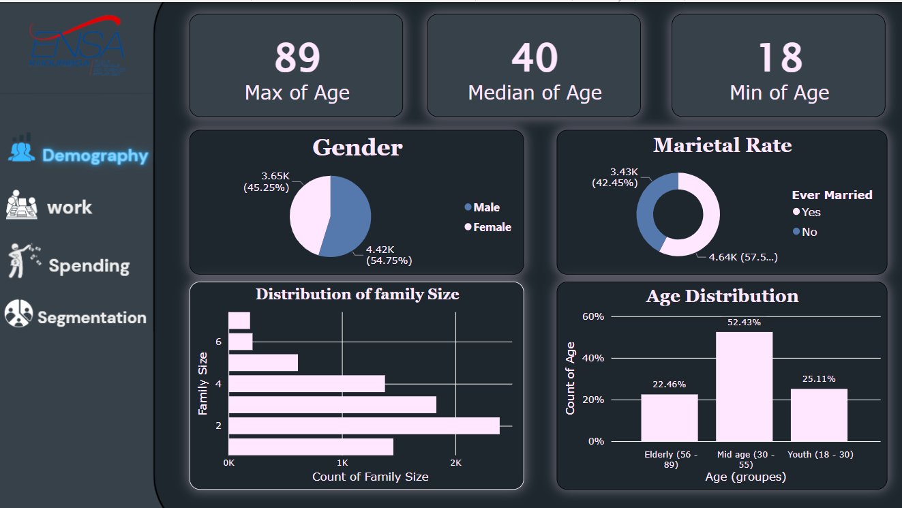

# Data-cleaning-and-visualisation
**Unlocking Market Potential: Data Cleaning and Visualization for an Automotive Pioneer**

Discover the roadmap to success for an automotive industry trailblazer ready to conquer new markets with their flagship products. Every decision counts, and this data-driven journey is where the future takes shape.

**Key Milestones:**

- **Data Cleansing (Python):** Begin your quest with Python-powered data cleansing. Transform raw data into pristine insights, ensuring the foundation of your analysis is rock-solid.

- **Data Visualization:**
    - **Part 1 (Python):** Craft compelling visual narratives using Python, unveiling the untapped potential within your data.
    - **Part 2 (Power BI):** Elevate your insights to new heights with the dynamic capabilities of Power BI. Transform data into actionable intelligence that propels your business forward.

It's time to harness the power of data, make informed decisions, and steer your automotive company towards unprecedented success in uncharted markets.

Fist Page of Power BI visualisation
 

